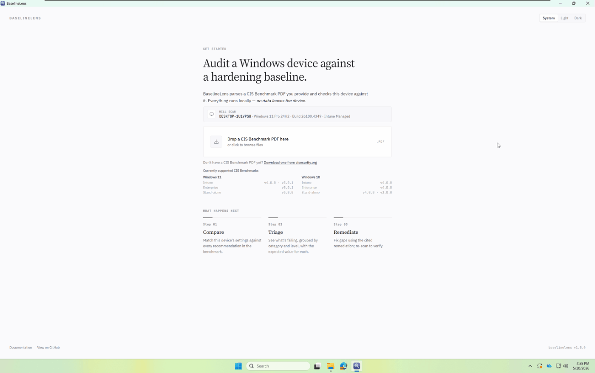

# BaselineLens

[](#license)
[](https://github.com/RogerCibrian/baselinelens/releases/latest)


Audit a Windows endpoint against a CIS Benchmark you provide — a local-only desktop dashboard with a one-page report for managers and a filterable workbench for admins.

<p align="center">
  
</p>

## The problem

Rolling out a CIS Benchmark usually goes like this: download the benchmark PDF, work out where the machine currently stands across hundreds of settings, decide which recommendations to implement and which to accept the risk on, then implement and re-check.

Most of that is done by hand — reading the PDF, checking registry keys and policies one at a time, tracking decisions in a spreadsheet, and re-checking after every change. It's slow, easy to get wrong, and hard to report on to anyone who isn't reading the same spreadsheet.

## What BaselineLens does

You give it the CIS Benchmark PDF; it does the rest of that loop on the device it's running on:

- **Compares** the device against every recommendation in the benchmark and scores it.
- **Shows what's failing** — grouped by category and level, with the expected value next to what was found.
- **Captures the decisions** — record an exception (with a reason) for anything you're accepting the risk on, attach notes, and attest to manual checks.
- **Verifies** — re-scan after you remediate and see what moved.

Two views over the same scan:

- **Overview** — a one-page report for managers: an overall compliance headline, score by level (L1 / L2 / BitLocker), a trend across recent scans, the weakest categories, and what changed since last time.
- **Console** — a workbench for admins: search, filter, and sort every recommendation, save views you return to, and open a detail drawer with the expected and found values for each check.

Everything runs on the device being audited. **No data leaves the machine.**

## Features

- Parses a CIS Benchmark PDF **you supply** — the app ships no benchmark content.
- Local-only audit driven by PowerShell, reading registry, security policy, and related settings.
- Manager **Overview** and admin **Console** over one scan.
- Per-recommendation **exceptions**, **notes**, and **attestations**.
- Search across IDs, titles, categories, expected/found values, notes, and exception reasons.
- Saved views, sortable and resizable table columns.
- Export a scan to **CSV** or **JSON**.
- Distributed as a single signed Windows `.msi`.

## Install

1. Download the latest signed installer from the [Releases page](https://github.com/RogerCibrian/baselinelens/releases/latest) (`BaselineLens_<version>_x64_en-US.msi`).
2. Run the installer.

**Requirements**

- Windows 10 or 11.

Running a scan reads protected system settings, so it requests elevation through a UAC prompt when it starts — you'll need admin rights on the device, or admin credentials to approve the prompt.

## Getting started

1. Launch BaselineLens.
2. Drop in your CIS Benchmark PDF (or browse to it). Don't have one? Grab it from [cisecurity.org](https://downloads.cisecurity.org/).
3. Confirm the parsed benchmark and target device, then run the scan.
4. Approve the UAC prompt when it appears, so the audit can read protected settings.
5. Review results in **Overview** and **Console**, record any exceptions or notes, remediate, and re-scan to verify.

## Supported benchmarks

BaselineLens is built and tested against these CIS Benchmark PDFs:

| OS | Profile | Tested versions |
| --- | --- | --- |
| Windows 11 | Intune | v4.0.0, v3.0.1 |
| Windows 11 | Enterprise | v5.0.1 |
| Windows 11 | Stand-alone | v5.0.0 |
| Windows 10 | Intune | v4.0.0 |
| Windows 10 | Enterprise | v4.0.0 |
| Windows 10 | Stand-alone | v4.0.0, v3.0.0 |

Other CIS Benchmark PDFs may parse, but anything outside this set is untested — BaselineLens runs the scan and warns you that some results may be incomplete or inaccurate.

## How it works

BaselineLens reads the CIS Benchmark PDF you supply and works out what each recommendation expects, then checks those settings on the local machine using built-in Windows PowerShell and shows the results in the dashboard. Everything happens on the device — nothing is sent anywhere. It's a native desktop app built with [Tauri](https://tauri.app/) (a Rust core with a web-based UI), shipped as a single Windows `.msi`.

## Build from source

```bash
npm install
npm run tauri dev      # run the app with hot reload
npm run tauri build    # produce a release .msi (Windows)
```

You'll need [Node.js](https://nodejs.org/), the [Rust toolchain](https://www.rust-lang.org/tools/install), and the [Tauri prerequisites](https://tauri.app/start/prerequisites/) for your platform.

## License

Dual-licensed under either of:

- Apache License, Version 2.0 ([LICENSE-APACHE](LICENSE-APACHE))
- MIT License ([LICENSE-MIT](LICENSE-MIT))

at your option.

## Support

BaselineLens is free and open source. If it saves you time, you can support its development with the **Sponsor** button at the top of this repository or [Buy Me a Coffee](https://buymeacoffee.com/rogercibrian).

---

<sub>Not affiliated with or endorsed by the Center for Internet Security, Inc. (CIS). "CIS Benchmark" is a trademark of CIS, used nominatively; BaselineLens ships no CIS content and parses a PDF you supply.</sub>
